# データベース再設計案

## 設計方針

現行の「1便＝1レコード」モデルから、運送会社の実業務に即した「会社 → 車両 → 配車計画 → 区間（Leg）」の階層モデルに移行する。ソロモード（自社管理）とマルチプラットフォームモード（公開マッチング）の両方を1つのDBスキーマで対応する。

---

## 新ER図

```mermaid
erDiagram
    companies {
        uint id PK
        string name "会社名"
        string display_name "匿名表示名（例: 神奈川エリアA社）"
        string address "本社住所"
        float headquarters_lat "本社緯度"
        float headquarters_lng "本社経度"
        string phone "電話番号（決済後のみ開示）"
        string email "連絡先メール"
        string logo_url "会社ロゴ"
        float rating_avg "平均評価"
        int total_deals "取引件数"
        string plan "free / standard / premium"
        datetime created_at
        datetime updated_at
    }

    users {
        uint id PK
        uint company_id FK "所属会社（nullable: 荷主は個人もあり得る）"
        string email UK
        string password_hash
        string name
        string role "owner / driver / dispatcher / shipper / admin"
        string phone
        bool is_active
        datetime created_at
        datetime updated_at
    }

    vehicles {
        uint id PK
        uint company_id FK "所有会社"
        string plate_number UK "車番（例: 横浜 100 あ 1234）"
        string vehicle_type "軽トラ / 2t / 4t / 10t / 大型"
        float max_weight "最大積載量 kg"
        string status "active / maintenance / retired"
        string note
        datetime created_at
        datetime updated_at
    }

    dispatch_plans {
        uint id PK
        uint company_id FK "会社"
        uint vehicle_id FK "使用車両"
        uint driver_id FK "当日の運転手（users.id）"
        date plan_date "配車日"
        string status "planned / in_progress / completed / cancelled"
        string note
        datetime created_at
        datetime updated_at
    }

    trip_legs {
        uint id PK
        uint dispatch_plan_id FK "所属する配車計画"
        int leg_order "区間順序（1, 2, 3...）"
        string origin_address
        float origin_lat
        float origin_lng
        string destination_address
        float destination_lat
        float destination_lng
        datetime departure_at "出発予定時刻"
        datetime arrival_at "到着予定時刻"
        string leg_type "outbound / return"
        string cargo_status "loaded / empty_seeking / empty_private"
        string cargo_description "積荷内容（既存荷の場合）"
        float cargo_weight "積荷重量 kg"
        float available_weight "空き積載量 kg"
        int price "希望料金（円）。empty_seekingの場合のみ"
        string visibility "private / public / company_only"
        text route_polyline
        int route_duration_sec
        mediumtext route_steps_json
        int delay_minutes
        string status "scheduled / in_transit / completed / cancelled"
        datetime created_at
        datetime updated_at
    }

    matches {
        uint id PK
        uint trip_leg_id FK "対象区間"
        uint requester_id FK "リクエスト送信者（users.id）"
        uint requester_company_id FK "リクエスト送信者の会社（nullable）"
        float cargo_weight "kg"
        string cargo_description
        string message
        string status "pending / approved / payment_pending / completed / rejected / cancelled"
        string reject_reason
        string request_type "shipper_to_company / company_to_company"
        datetime created_at
        datetime updated_at
    }

    payments {
        uint id PK
        uint match_id FK
        uint payer_id FK "users.id"
        int amount "円"
        string currency "jpy"
        string stripe_payment_id
        string status "pending / succeeded / failed / refunded"
        datetime paid_at
        datetime created_at
        datetime updated_at
    }

    chat_rooms {
        uint id PK
        uint match_id FK "マッチングに紐づく"
        string status "active / closed"
        datetime created_at
        datetime updated_at
    }

    chat_messages {
        uint id PK
        uint chat_room_id FK
        uint sender_id FK "users.id"
        text content
        string status "sent / filtered / warned"
        string filtered_reason "検知理由（電話番号, メールアドレス等）"
        datetime created_at
    }

    reviews {
        uint id PK
        uint match_id FK
        uint reviewer_id FK "users.id"
        uint reviewee_company_id FK "companies.id"
        int rating "1-5"
        string comment
        datetime created_at
    }

    trackings {
        uint id PK
        uint dispatch_plan_id FK "配車計画に紐づく"
        uint trip_leg_id FK "区間に紐づく（nullable）"
        float lat
        float lng
        datetime recorded_at
    }

    blocked_patterns {
        uint id PK
        string pattern "正規表現パターン"
        string description "電話番号 / メールアドレス / URL 等"
        bool is_active
        datetime created_at
    }

    user_violations {
        uint id PK
        uint user_id FK
        uint chat_message_id FK
        string violation_type "contact_info_leak / spam / abuse"
        string detail
        datetime created_at
    }

    subscriptions {
        uint id PK
        uint company_id FK
        string plan "free / standard / premium"
        string stripe_subscription_id
        string status "active / cancelled / past_due"
        datetime current_period_start
        datetime current_period_end
        datetime created_at
        datetime updated_at
    }

    companies ||--o{ users : "company_id"
    companies ||--o{ vehicles : "company_id"
    companies ||--o{ dispatch_plans : "company_id"
    companies ||--o{ reviews : "reviewee_company_id"
    companies ||--o{ subscriptions : "company_id"
    users ||--o{ dispatch_plans : "driver_id"
    users ||--o{ matches : "requester_id"
    users ||--o{ payments : "payer_id"
    users ||--o{ chat_messages : "sender_id"
    users ||--o{ reviews : "reviewer_id"
    users ||--o{ user_violations : "user_id"
    vehicles ||--o{ dispatch_plans : "vehicle_id"
    dispatch_plans ||--o{ trip_legs : "dispatch_plan_id"
    dispatch_plans ||--o{ trackings : "dispatch_plan_id"
    trip_legs ||--o{ matches : "trip_leg_id"
    trip_legs ||--o{ trackings : "trip_leg_id"
    matches ||--o{ payments : "match_id"
    matches ||--|| chat_rooms : "match_id"
    matches ||--o{ reviews : "match_id"
    chat_rooms ||--o{ chat_messages : "chat_room_id"
    chat_messages ||--o{ user_violations : "chat_message_id"
```



---

## テーブル設計の詳細

### companies（会社）

運送会社の基本情報。マネタイズの要である「段階的情報開示」のために、公開情報と非公開情報を分離。

| カラム | 型 | 説明 | 公開タイミング |
|--------|------|------|--------------|
| name | string | 正式名称 | マッチング承認後 |
| display_name | string | 匿名表示名 | 常時 |
| phone | string | 電話番号 | 決済完了後 |
| address | string | 本社住所 | 決済完了後 |
| rating_avg | float | 平均評価 | マッチング申請後 |
| total_deals | int | 取引件数 | マッチング申請後 |

### users（ユーザー）

ロールを拡張。運送会社内の役割分担に対応。

| ロール | 説明 |
|--------|------|
| owner | 会社オーナー（配車計画作成・承認） |
| driver | ドライバー（位置情報記録・配送実行） |
| dispatcher | 配車担当者（配車計画作成のみ） |
| shipper | 荷主（マッチングリクエスト・決済） |
| admin | システム管理者 |

### dispatch_plans（配車計画）

1日1台の配車を管理する単位。ソロモードの核心。

**例**: トラック③の1日の配車計画
```
dispatch_plan: {
  vehicle: "横浜 100 あ 1234"（10t）,
  driver: "田中太郎",
  plan_date: "2026-03-12",
  legs: [
    { order: 1, 横浜→小田原, cargo_status: "loaded", visibility: "private" },
    { order: 2, 小田原→横浜, cargo_status: "empty_seeking", visibility: "public" }
  ]
}
```

### trip_legs（区間）

配車計画を構成する各区間。旧`trips`テーブルの後継。

**cargo_status の意味**:
| 値 | 意味 | マッチング対象 |
|----|------|--------------|
| loaded | 荷物あり（自社案件） | No |
| empty_seeking | 空車・荷物募集中 | Yes |
| empty_private | 空車・募集しない | No |

**visibility の意味**:
| 値 | 意味 |
|----|------|
| private | 自社のみ閲覧可 |
| public | 全ユーザーに公開 |
| company_only | 運送会社のみに公開（荷主には非公開） |

### matches（マッチング）

旧テーブルからの主な変更点:
- `trip_id` → `trip_leg_id`（便単位 → 区間単位）
- `shipper_id` → `requester_id`（荷主以外もリクエスト可能に）
- `requester_company_id` 追加（会社間マッチング対応）
- ステータスに `payment_pending` 追加

**ステータス遷移**:
```
pending → approved → payment_pending → completed
  ↓
rejected

cancelled（どのステータスからでも）
```

### chat_rooms / chat_messages（チャット）

マッチング承認時に自動作成。メッセージ送信時にサーバーサイドでフィルタリング。

**フィルタリングフロー**:
```
メッセージ送信
  ↓
blocked_patternsと照合
  ↓
├─ 検知なし → status: "sent" → 送信
└─ 検知あり → status: "filtered" → 送信者に警告表示
                                → user_violations に記録
```

### reviews（評価）

マッチング完了後、双方が相互評価。`reviewee_company_id`で会社に対する評価とする（個人ではなく会社の信頼度を蓄積）。

### subscriptions（サブスクリプション）

**プラン例**:
| プラン | 料金 | 機能 |
|--------|------|------|
| free | 無料 | ソロモードのみ（配車管理）。公開マッチングは月3件まで |
| standard | ¥9,800/月 | 公開マッチング無制限。チャット機能。基本的な統計 |
| premium | ¥29,800/月 | 全機能。API連携。優先表示。詳細な分析レポート |

---

## マイグレーション戦略

既存のデータを活かしつつ段階的に移行する。

### Phase 1: 基盤テーブル追加
1. `companies`テーブル作成
2. 既存`users.company`（文字列）から`companies`レコードを生成
3. `users`に`company_id`カラム追加、既存データを紐づけ
4. `vehicles`に`company_id`追加、`user_id`からcompanyを逆引きして設定

### Phase 2: 配車構造の移行
1. `dispatch_plans`テーブル作成
2. `trip_legs`テーブル作成
3. 既存`trips`を`dispatch_plans` + `trip_legs`に分割移行
4. 既存`matches.trip_id`を`matches.trip_leg_id`に移行

### Phase 3: チャット・評価・課金
1. `chat_rooms`, `chat_messages`テーブル作成
2. `reviews`テーブル作成
3. `subscriptions`テーブル作成
4. `blocked_patterns`初期データ投入

### Phase 4: 旧テーブルの廃止
1. `trips`テーブルを非推奨にし、読み取り専用に
2. `deliveries`テーブル（レガシー）を削除
3. 新構造への完全移行を確認後、旧テーブルを削除

---

## インデックス設計

```sql
-- 配車計画の検索
CREATE INDEX idx_dispatch_plans_company_date ON dispatch_plans(company_id, plan_date);
CREATE INDEX idx_dispatch_plans_driver ON dispatch_plans(driver_id);
CREATE INDEX idx_dispatch_plans_status ON dispatch_plans(status);

-- 区間の検索（公開マッチング用）
CREATE INDEX idx_trip_legs_dispatch_plan ON trip_legs(dispatch_plan_id);
CREATE INDEX idx_trip_legs_visibility_cargo ON trip_legs(visibility, cargo_status);
CREATE INDEX idx_trip_legs_departure ON trip_legs(departure_at);
CREATE INDEX idx_trip_legs_status ON trip_legs(status);

-- マッチング
CREATE INDEX idx_matches_trip_leg ON matches(trip_leg_id);
CREATE INDEX idx_matches_requester ON matches(requester_id);
CREATE INDEX idx_matches_status ON matches(status);

-- チャット
CREATE INDEX idx_chat_messages_room ON chat_messages(chat_room_id, created_at);

-- 評価
CREATE INDEX idx_reviews_company ON reviews(reviewee_company_id);

-- トラッキング
CREATE INDEX idx_trackings_dispatch_plan ON trackings(dispatch_plan_id, recorded_at);
```
