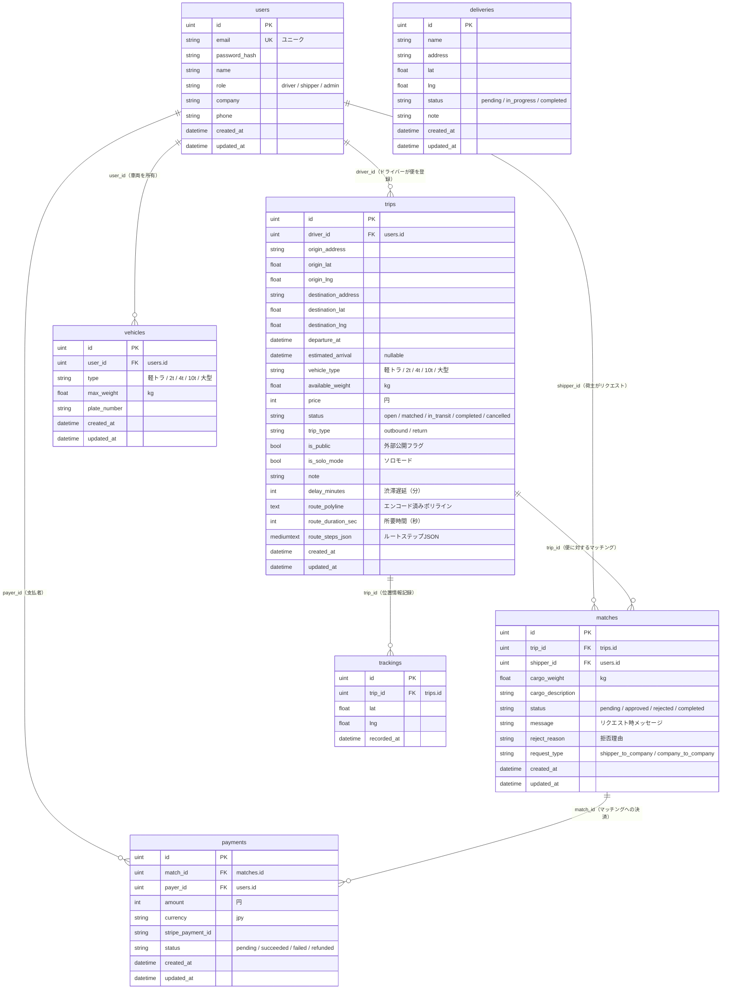

# ER Mapping（エンティティ関連図）

## ER図（Mermaid）



## テーブル一覧

| テーブル名 | 説明 | 主な関連 |
|-----------|------|---------|
| users | ユーザー（ドライバー/荷主/管理者） | trips, matches, vehicles, payments |
| trips | 配送便（往路・帰り便） | users(driver), matches, trackings |
| matches | マッチングリクエスト | trips, users(shipper), payments |
| vehicles | 車両情報 | users |
| payments | 決済情報（Stripe） | matches, users(payer) |
| trackings | 位置情報トラッキング | trips |
| deliveries | 配送先（レガシー） | なし |

## リレーション詳細

### users → trips（1対多）
ドライバー（`role = driver / transport_company`）が配送便を登録する。`trips.driver_id` が `users.id` を参照。

### users → matches（1対多）
荷主（`role = shipper`）がマッチングリクエストを送信する。`matches.shipper_id` が `users.id` を参照。

### trips → matches（1対多）
1つの便に対して複数の荷主からマッチングリクエストが届く。`matches.trip_id` が `trips.id` を参照。

### matches → payments（1対多）
承認済みマッチングに対して決済が行われる。`payments.match_id` が `matches.id` を参照。

### users → payments（1対多）
荷主が決済を行う。`payments.payer_id` が `users.id` を参照。

### users → vehicles（1対多）
ドライバーが複数の車両を登録できる。`vehicles.user_id` が `users.id` を参照。

### trips → trackings（1対多）
便の位置情報を時系列で記録。`trackings.trip_id` が `trips.id` を参照。

## ステータス遷移

### Trip Status
```
open → matched → in_transit → completed
  ↓
cancelled
```

### Match Status
```
pending → approved → completed
  ↓
rejected
```
※ 現状は `approved → completed` の間に決済が強制されていない（改善対象）

### Payment Status
```
pending → succeeded
  ↓
failed
  ↓
refunded
```
